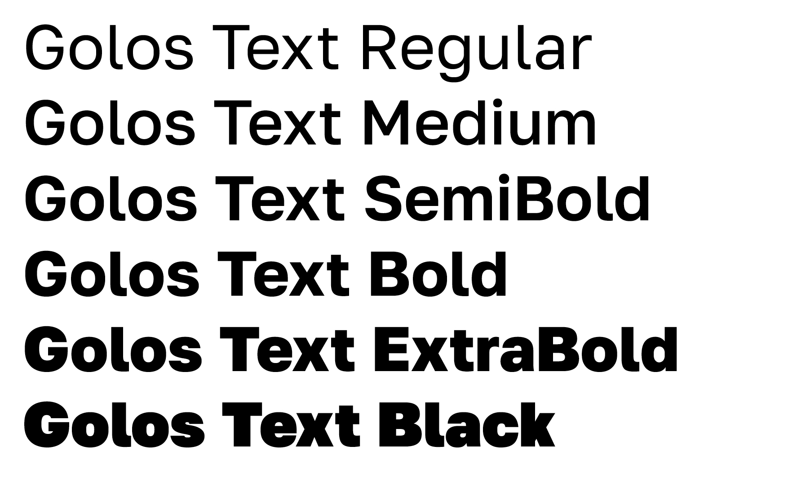

# My Font

Golos is a versatile closed sans-serif commissioned by Smena and AIC Media for state and social service websites. Golos Text suits perfectly for continuous reading on screen. It includes five weights from Regular to Black. Golos was designed by Alexandra Korolkova and Vitaly Kuzmin and released by Paratype in 2019.

## Changelog

**08 December 2022. Version 2.004**
- Added missing glyphs - Contributors / Emma Marichal

## License

This Font Software is licensed under the SIL Open Font License, Version 1.1.
This license is available with a FAQ at
https://scripts.sil.org/OFL

## Repository Layout

This font repository structure is inspired by [Unified Font Repository v0.3](https://github.com/unified-font-repository/Unified-Font-Repository), modified for the Google Fonts workflow.
